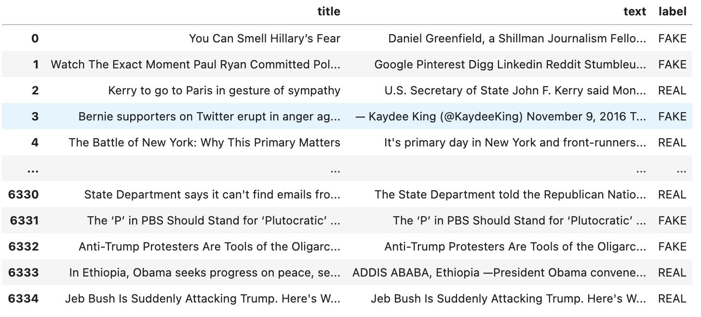
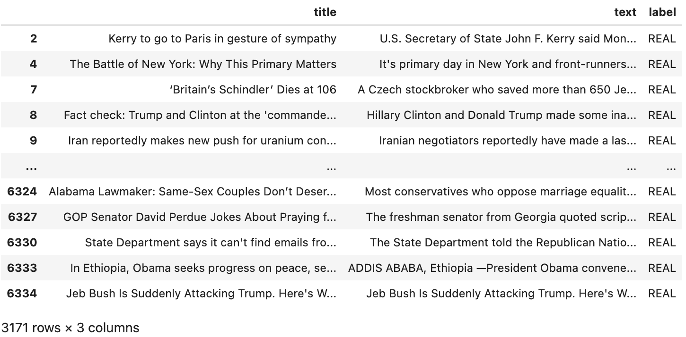
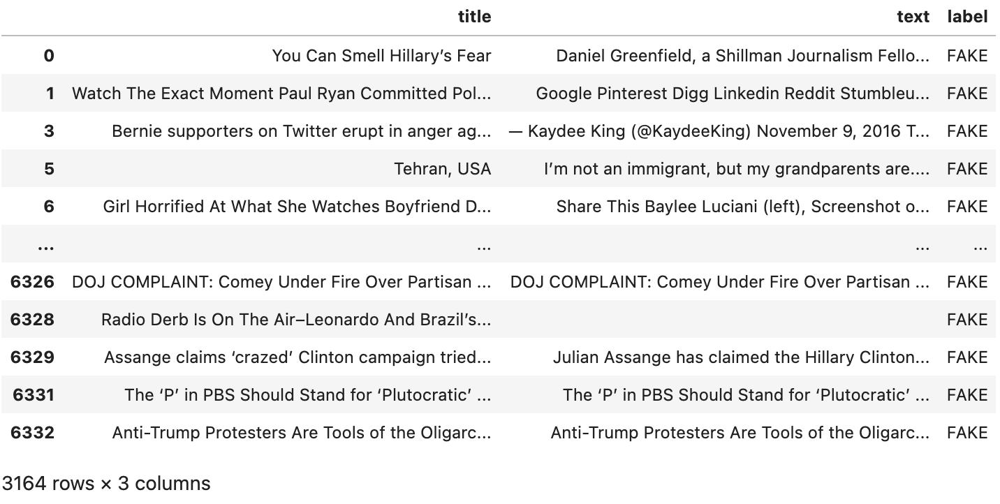
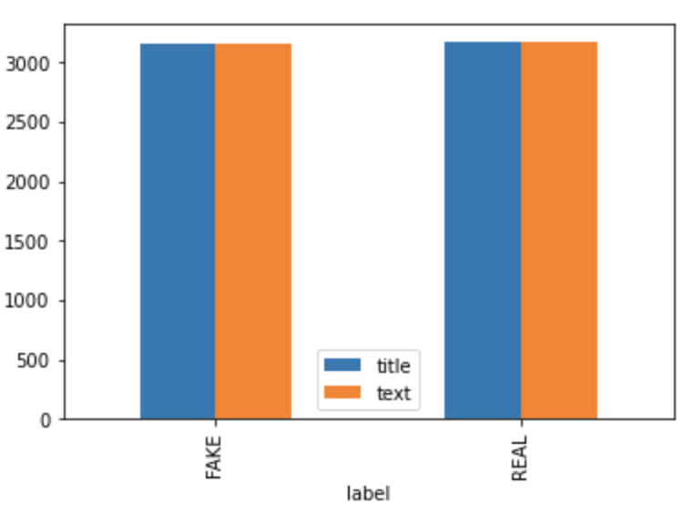
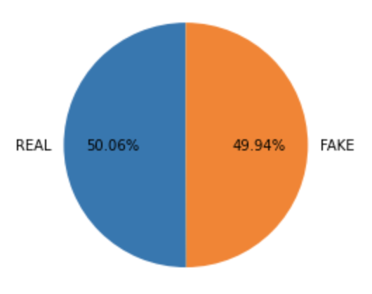

# Final-Project-Zongqi-Lyu & Yiqing Zhang
## First commit, declare team members and topic
***Topic:***  
*Fake News Detector*   
***Team member:***  
- Zongqi Lyu  
- Yiqing Zhang  
  
## Second commit, adding script  
- For this commit we added a python script to download the dataset from GitHub and write to a CSV file.
We used the requests module to get the raw data from GitHub and use the python built-in open and write
function to create CSV file and write the raw data on it.
## Third commit, loads dataset into dataframe
- For this commit we added a Jupytor Notebook file to load the CSV file into dataframe. The library we used to achieve this are pandas and matplotlib. We use pandas to read the CSV file and stored it into a variable, with that variable we can easily check the columns and do some operation based on inquiry. Here is a snapshot pandas variable:   
We have also divided the table into Real news table and Fake news table as following:
  
  
Using the tables above, we plot a bar chart first to compare the amount of fake new and real news in this dataset and here is the bar chart we have:
  
As you can see in the figure above, we can see that the number of fake news is almost the same as the real news, we can't tell anything else if no further detailed information is given. Therefore, we plot our second chart, for this one we decided to use pie chart and label the percentage on the chart:
  
From the pie chart above, we can say that even though they have almost the same number of amount in this dataset, but still the number of real news is slightly more than the number of fake news.  
## Fourth commit, build and test model
- For this commit, we built the model using sklearn library. Use fit method to train the model and use use 
predict method to test the model. As shown in the Jupytor Notebook file, the model works perfectly, it correctly
predicted the fake and real news. (We have selected 1 fake new and 1 real new to test the model)
